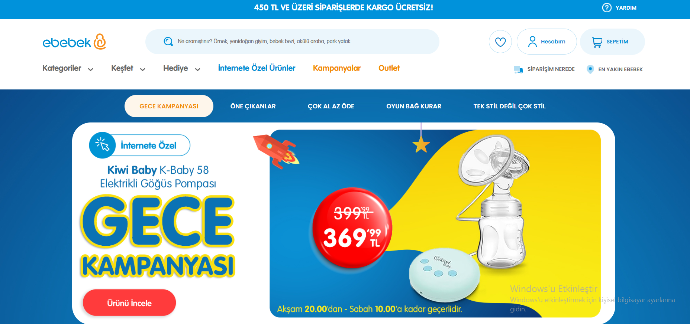

# ebebek QA Project

[ebebek](https://www.e-bebek.com/) web sitesi için Selenium Framework ile verilen test caseler için otomasyon yazılmıştır.

## Test Case

1. https://www.e-bebek.com/ sitesi açılır.
2. Arama çubuğuna "kaşık maması" yazılır ve arama sonucunda gelen sonuçlardan
    en son ürün açılır, açılan ürünle arama sonucunda tıklanan ürünün aynı olduğu
     doğrulanır.
3. Ürün sepete eklenir.
4. Sağdan açılan modadan sepeti gör butonuna tıklanır.
5. Alışverişi tamamla butonuna tıklanır.
6. Üye girişi ekranının açıldığı doğrulanır.

## Dikkat Edilmesi Gerekenler

Proje Java programlama dilinde yazılmalıdır. Maven repo kullanılmalıdır.

- Kodlar gthub üzernden paylaşılması gereklidir. 

- Yazılacak senaryo için Selenum ve JUnit/Testng kullanılmalıdır.

- Assertions kullanarak senaryonun doğru çalışırlığı kontrol edilmelidir.

- Log kullanılmalıdır.

- Page object model uygulanmalıdır.

- OOP prensplerne uygun gelişitrilmelidir

## Used Technologies
- Java
- JUnit5
- Selenium
- Page Object Model
- Maven
- Log4j

## Author - [tugbaltun](https://github.com/tugbaltun)

